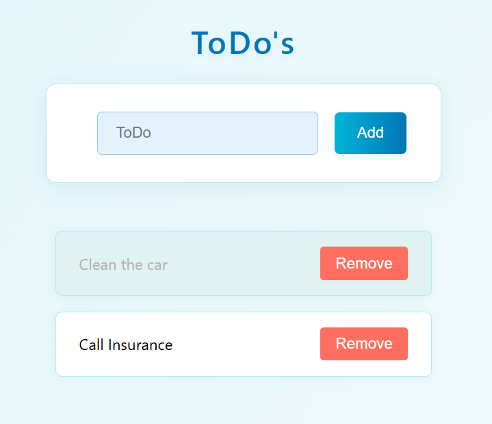

# Quality Assurance (QA) Engineer Challenge

## Inhaltsverzeichnis

## Application


### Create a todo
- Click on the "Add" button. 
- The input field will be cleared and ready for a new todo.
- The new todo will be added to the list.

### Mark a todo as done
- Click on the todo you want to mark as done.
- The todo will be shown as done.
- Click on the todo again to mark it as not done.

### Delete a todo
- Click on the "Delete" button next to the todo you want to delete.
- The todo will be removed from the list.

## Building and Starting the Application
### Using Github Codespaces (Recommended / Preferred)
1. Open the repository in [GitHub](https://github.com/buhlergroup/qa-engineer-challenge-01)
2. Click on the "Code" button and select "Open with Codespaces".
3. Create a new codespace.
4. Wait for the codespace to be created and the environment to be set up.
5. Once the codespace is ready, you can start working on the application directly in the browser.
6. Install the dependencies:
   ```bash
   npm install
7. Build the application:
   ```bash
   npm run build
8. Start the application:
   ```bash
   npm start
   # Apllication will be available at `http://localhost:3000`.

### Using Node.js and npm
To build the application, you need to have Node.js and npm installed. Follow these steps:
1. Make sure you have Node.js and npm installed on your machine. You can download them from [Node.js official website](https://nodejs.org/).
2. Clone the repository:
   ```bash
   git clone https://github.com/buhlergroup/qa-engineer-challenge-01.git
3. Navigate to the project directory:
   ```bash
   cd qa-engineer-challenge-01
4. Install the dependencies:
   ```bash
   npm install
5. Build the application:
   ```bash
   npm run build
6. Start the application:
   ```bash
   npm start
   # Apllication will be available at `http://localhost:3000`.
   
### Using Docker or Podman with Docker / Podman Compose
1. Make sure you have Docker installed on your machine.
2. Clone the repository:
   ```bash
   git clone https://github.com/buhlergroup/qa-engineer-challenge-01.git
3. Navigate to the project directory:
   ```bash
   cd qa-engineer-challenge-01
4. Build the Docker image:
   ```bash
   docker compose up
   # or if you are using Podman
   podman compose up
   # Apllication will be available at `http://localhost:3000`.

## Challenge
### Description
It is important to bring software to market quickly in order to secure competitive advantages and respond to customer needs at an early stage. By launching early, companies can gather feedback from real users, steer product development in a targeted manner, and implement innovations faster. An early release also makes it possible to gain market share and react flexibly to changes in the market environment. Fast releases also promote continuous improvement and help minimize risks by identifying problems early.

However, it is also important to ensure that the software is of high quality and meets the requirements of the users. This is where quality assurance (QA) comes into play. 
This point was not sufficiently considered in the development of the application. The application is not tested and therefore has no quality assurance.

### Task
Your task is to implement a quality assurance (QA) solution for the application. The goal is to ensure that the most important features of the application are tested and that the application is of high quality.

### Requirements
- The most important features to be tested are identified
- Cypress or Playwright is used as the testing framework
- Cypress or Playwright is configured to run tests
- Tests are written in JavaScript or TypeScript
- At least 2 tests are written

### General Conditions
- Maximum of **45 minutes** for the task
- The task should be completed in the browser using **GitHub Codespaces**
- **Googling** and **Copilot** is allowed
